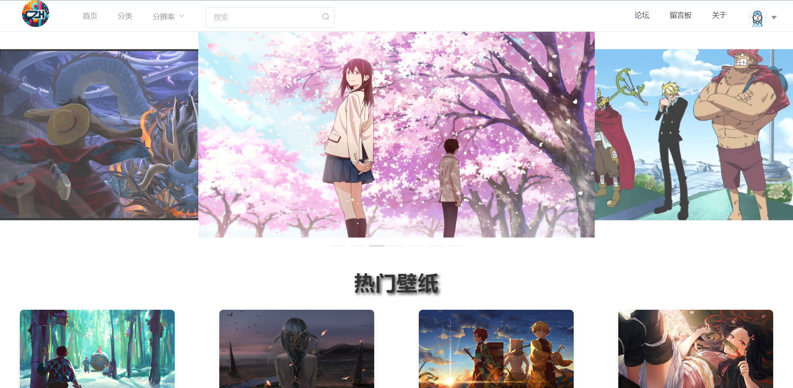
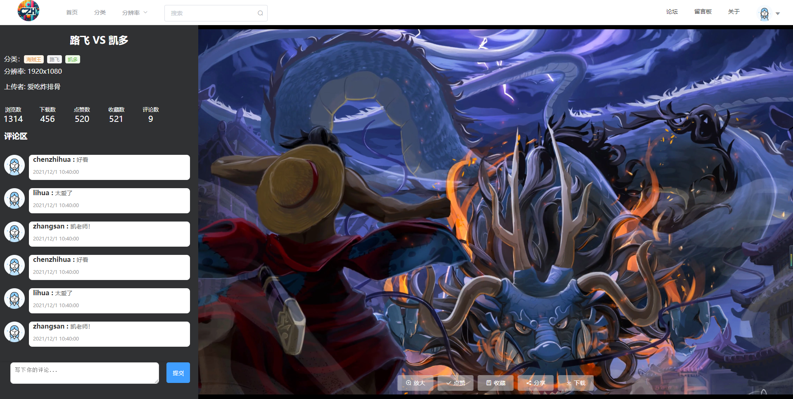
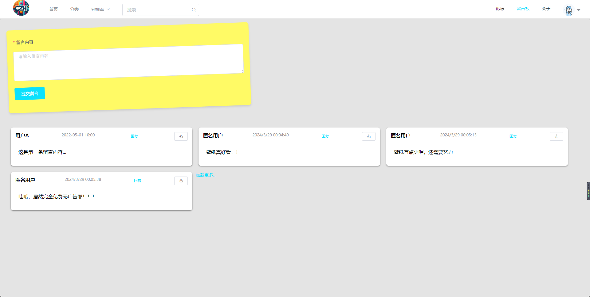
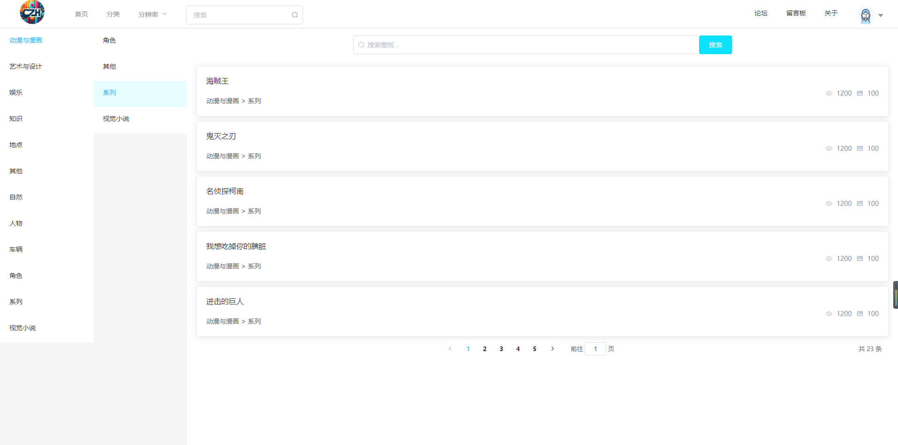
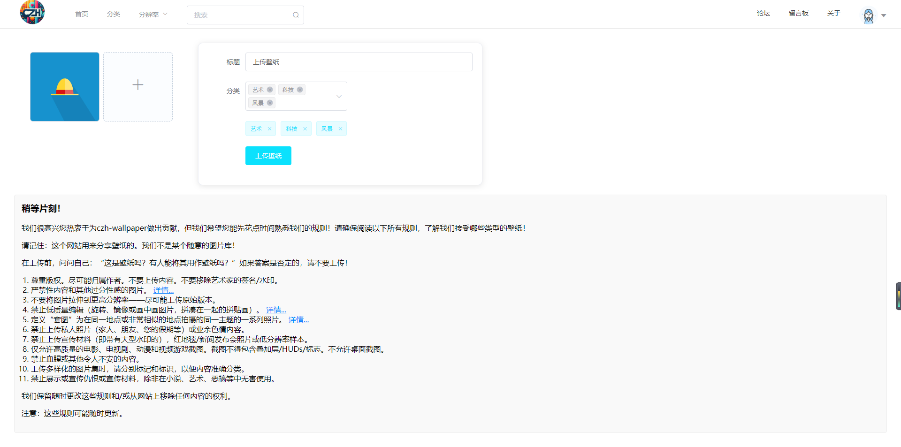
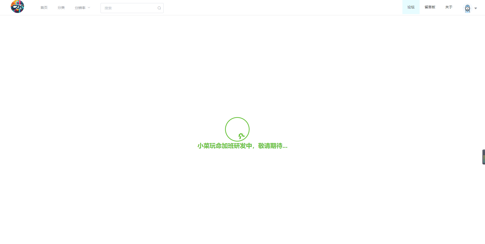
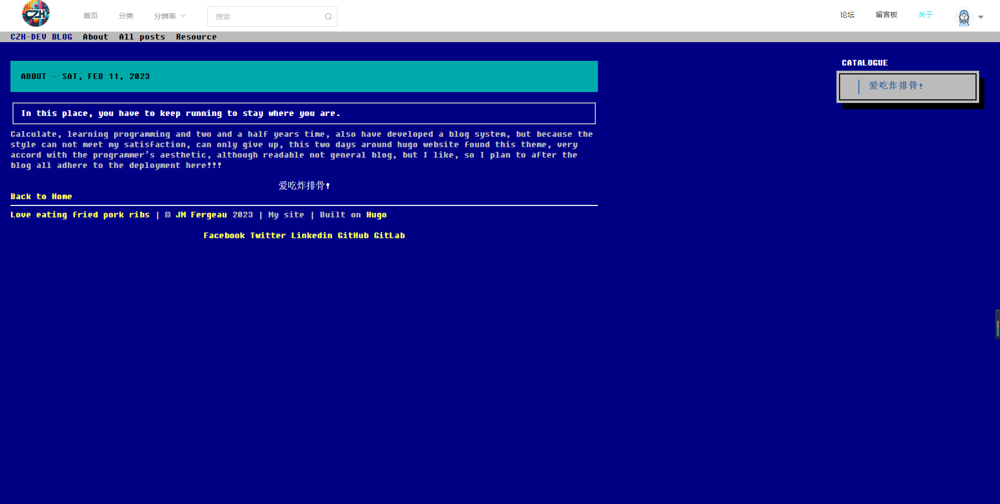

# 壁纸网站前端项目

## 项目简介

欢迎访问壁纸网站前端项目！本项目是一个用于展示和分享高质量壁纸的网站前端应用，提供了一套友好的界面以便用户浏览、下载和上传壁纸。

## 技术栈

本项目使用的技术包括：

- HTML
- CSS/SCSS
- JavaScript
- Vue.js
- 响应式设计，以适配各种屏幕尺寸

## 功能列表

- 用户账户注册与登录
- 壁纸展示
- 壁纸搜索与分类浏览
- 用户上传壁纸
- 壁纸收藏与下载

## 页面截图

> 尊敬的读者，
> 
> 首先，请允许我对由于技术限制所可能带来的不便致以诚恳的歉意。作为主要专注后端开发的工程师，我在前端设计和页面展现方面的能力尚处在学习阶段。正因如此，您所见到的页面截图可能无法展示出想象中的完整性，细节处理和设计美学可能没有达到专业前端开发者的水平。
> 
> 在这份不够成熟的作品中，您可能会遇到的问题包括但不限于布局错位、样式简单甚至过于粗煳、交互设计流畅性不足、以及响应式网站设计的不完善等。
> 
> 我非常清楚，一个优秀的用户界面是用户体验的重要组成部分，因此，我已致力于改进我的前端技术，并寻求合适的解决方案或专业人员的帮助，以期修正现存问题，并提高页面的整体质量。
> 
> 在此过程中，您的一切意见和建议都无比珍贵。如果您有任何反馈或者建议，欢迎直接与我联络。我承诺将尽最大努力去理解和实现您的需求，以提供更加美观、用户友好和直观的产品。
> 
> 最后，感谢您的理解和耐心。我相信随着时间的推移，不仅会提高我的前端技能，还会不断提升我们的产品质量，最终为您交付一个令大家满意的结果。
> 
> 再次为初期存在的不足向您道歉，并期待我们能共同见证每一个小小进步所带来的改变和成长。
> 
> 诚挚地，
> 
> czh-dev

#### 首页
 
#### 壁纸详情页

#### 留言板

#### 分类页面

#### 我的上传页

#### 论坛页

#### 关于页面


## 本地开发环境搭建

1. 克隆仓库：

```sh
git clone https://gitee.com/czh-dev/wallpaper-web.git
cd wallpaper-web
```

2. 安装依赖：

```sh
npm install
```

3. 启动服务：

```sh
npm run serve 
```

然后在浏览器中访问 `http://localhost:8080` 即可查看效果。

## 构建与部署

1. 构建项目：

```sh
npm run build
```

2. 部署构建好的文件到你的服务器或静态站点托管服务。

## 贡献指南

如果你有兴趣为壁纸网站前端项目作出贡献，请遵循以下步骤：

1. Fork 仓库。
2. 创建一个新的分支 (`git checkout -b feature/your-feature`).
3. 提交更改 (`git commit -am 'Add some feature'`).
4. 推到分支 (`git push origin feature/your-feature`).
5. 创建一个新的Pull Request。

我们欢迎所有有助于项目改善的贡献，并感谢每一位贡献者。

## 联系方式

如果你有任何问题，欢迎通过邮件（c262222zh@163.com 或提交Issue。）联系项目维护者。